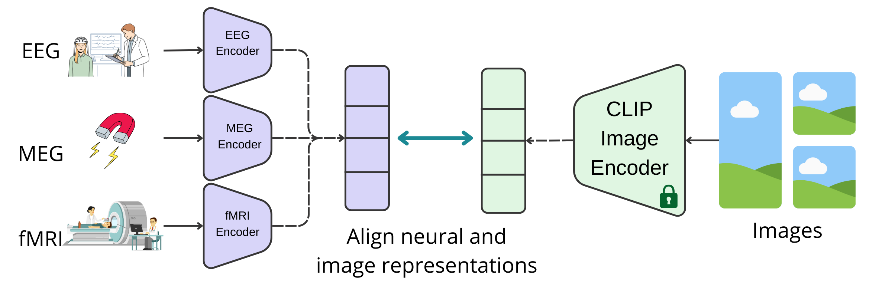
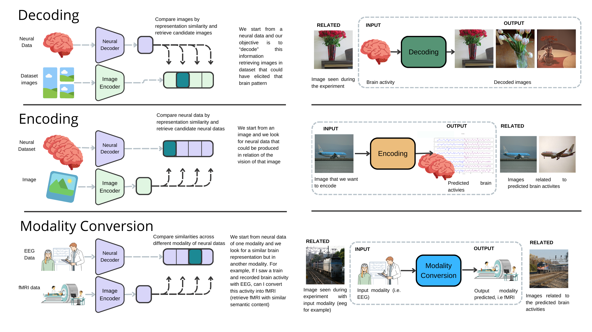
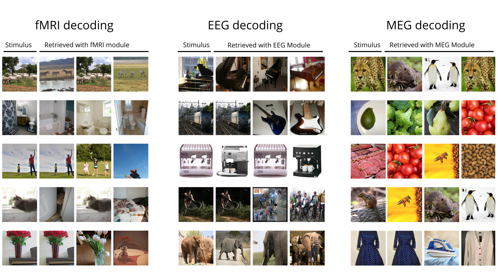
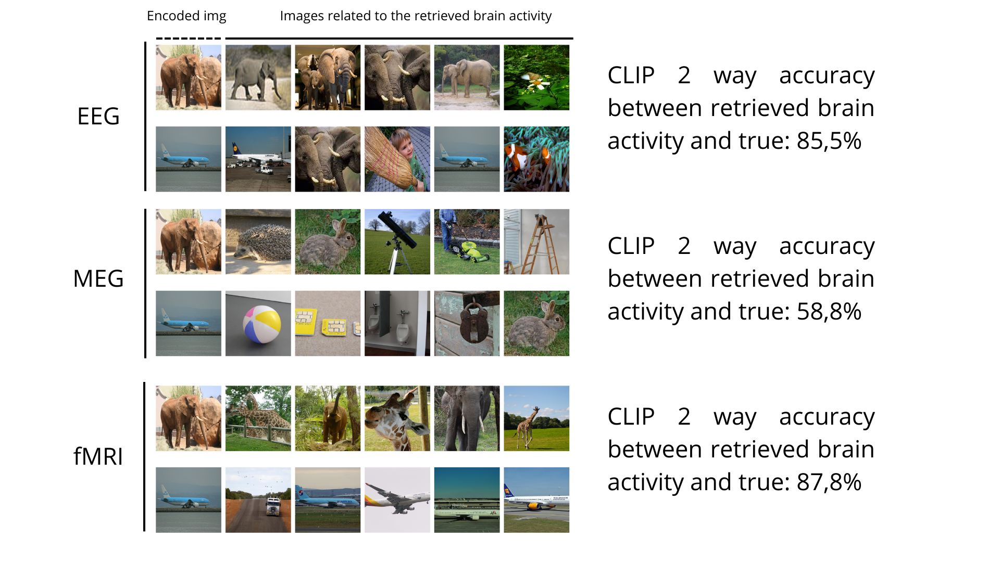

A step toward a neural foundation model for vision: Neural representation alignment of fMRI, EEG, MEG to solve decoding, encoding and modality conversion

In recent years, the expansion of dataset sizes and model complexities for sequence modeling across various modalities has significantly enhanced the performance of AI models. This advancement has facilitated the development of large-scale foundation models capable of efficiently processing diverse input modalities such as language, speech, images, video, code, and more. Additionally, the availability of these large pretrained models has positively impacted neuroscience research, leading to improved encoding/decoding models. However, the field still lacks a foundational model specifically designed for neuroscientific data—a brain foundation model. This study presents a novel method for aligning the representations of visual stimuli obtained with CLIP with neural data through the application of advanced contrastive learning techniques across multiple neural imaging modalities, including EEG, MEG, and fMRI. We leverage large datasets for each modality, namely ImageNetEEG, MEG THINGS, and the Natural Scenes Dataset. Through contrastive learning, we develop a model that maps images and neural data from different subjects and sources into a shared representation space. This allows for the translation of neural data into meaningful representations that can be leveraged for downstream tasks. Our framework excels in several critical areas: accurately decoding visual content from neural signals across the three modalities, efficiently encoding images into representations compatible with neural data, and smoothly translating information between different neural data modalities. By achieving high precision in capturing semantic information across these varied brain imaging techniques, our research marks a step toward the creation of neural foundation models specifically designed for visual processing tasks.

A schematic description of our pipeline:

The task that can be solved:

Some examples of decoding

And encoding

| **Neural Module** | **top1 accuracy** | **top5 accuracy** | **CLIP 2 way** | **baseline accuracy (\%)** | **baseline top5 (\%)** | **Retrieval dataset size** | **Number of classes** |
|----------------------------|----------------------------|----------------------------|-------------------------|-------------------------------------|---------------------------------|-------------------------------------|--------------------------------|
| EEG  (ImageNet)            | 40,0                       | 54,3                       | 79,4                    | 2,5                                 | 12,5                            | 332                                 | 40                             |
| MEG  (THINGS)              | 1,2                        | 6,1                        | 60,1                    | 0,13                                | 0,65                            | 2400                                | 720                            |
| fMRI (NSD)                 | -                          | -                          | 90,3                    | -                                   | -                               | 982                                 | -                              |

| **Conversion** | **Clip 2 way decoding accuracy** | **Normalized Clip 2 way decoding accuracy**} |
|---------------------|---------------------------------------|--------------------------------------------------|
| fMRI to EEG         | 0.6710                                | 0.8370                                           |
| MEG to EEG          | 0.6790                                | 0.8470                                           |
| fMRI to MEG         | 0.5679                                | 0.9540                                           |
| EEG to MEG          | 0.5594                                | 0.9396                                           |
| EEG to fMRI         | 0.7648                                | 0.8598                                           |
| MEG to fMRI         | 0.7928                                | 0.8912                                           |

